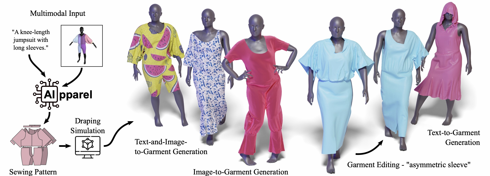

# Code Repository for AIpparel: A Multimodal Foundation Model for Digital Garments _(CVPR 2025 Highlight)_. 
<p align="center">
  <a href='[https://arxiv.org/abs/2405.04533](https://arxiv.org/abs/2412.03937)'>
    
  </a>
  <a href='https://georgenakayama.github.io/AIpparel/'>
  
  </a>
  <a href='https://huggingface.co/georgeNakayama/AIpparel'>
  
  </a>
</p>



## Environment Setup
We use [conda](https://docs.conda.io/projects/conda/en/latest/user-guide/install/index.html) to manage our environment. Please install it if you haven't done so. 

After installing conda, create a new environment using 
```
conda create -n aipparel python=3.10 -y 
conda activate aipparel
```
Install torch 2.3.1 (we tested using CUDA 12.1). 
```
pip install torch==2.3.1 torchvision==0.18.1 torchaudio==2.3.1 --index-url https://download.pytorch.org/whl/cu121
```
Install the other dependencies via pip 
```
pip install -r requirements.txt
```
Add the project directory to the PYTHONPATH 
```
export PYTHONPATH=$PYTHONPATH:/path/to/AIpparel-Code
```

## Dataset 


Download [GarmentCodeData](https://www.research-collection.ethz.ch/handle/20.500.11850/673889) and place the different partitioned folders (i.e., `garments_5000_xx`) into a common folder. Then change the `root_dir` [config file](configs/data_wrapper/dataset/gcd_mm.yaml) to point to root directory. 

Download the [GarmentCodeData-Multimodal dataset](https://huggingface.co/georgeNakayama/AIpparel) (`gcd_mm_editing.zip` and `gcd_mm_captions.zip`), which annotates GarmentCodeData with editing instructions and textual descriptions. Change the `editing_dir` and `caption_dir` in the [config file](configs/data_wrapper/dataset/gcd_mm.yaml) to point to the unzipped directories. 

## Pre-trained Model Weights
Download the pre-trained AIpparel model weights [here](https://huggingface.co/georgeNakayama/AIpparel) (`aipparel_pretrained.pth`). To evaluate or generate sewing patterns using it, change the `pre_trained`  entry in the [config](configs/aipparel.yaml) file to point to the the downloaded pre-trained weights.

## Logging
We provide logging logistics using WANDB. Set your wandb info [here](configs/experiment/wandb_info/wandb.yaml) and login to your account through the command line.

## Evaluation 
We provide evaluation scripts under [eval_scripts](eval_scripts). Change environment variables to set the visible GPU devices and the path to this repository. Metrics will be saved to Wandb, and generated outputs will be saved to the output directory (set in the [config](configs/aipparel.yaml)).

## Training
For training, we provide a training script under [scripts](scripts) directory. Change environment variables to set the visible GPU devices and the path to this repository. Training logs will be saved to Wandb.

## Citation

If you are using our model or dataset in your project, consider citing our paper.

```
@article{nakayama2025aipparel,
    title={AIpparel: A Large Multimodal Generative Model for Digital Garments}, 
    author={Kiyohiro Nakayama and Jan Ackermann and Timur Levent Kesdogan 
            and Yang Zheng and Maria Korosteleva and Olga Sorkine-Hornung and Leonidas Guibas
            and Guandao Yang and Gordon Wetzstein},
    journal = {Computer Vision and Pattern Recognition (CVPR)},
    year={2025}
}
```
